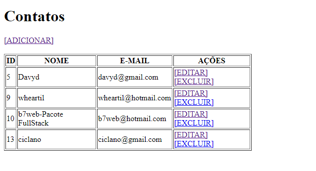

CRUD BÁSICO EM PHP
===

Crud básico feito em PHP, seguindo as aulas do curso do bonieky lacerda - Pacote FullStack da empresa B7web

## Papar Information
- Title:  `Crud Básico Feito em PHP, seguindo as aulas do curso do bonieky`
- Authors:  `Davyd Cristiano`

- Preprint: 


## Install & Dependence
- MySQL WorkBanch 8.0
- XAMP
- Vscode Studio

## Direitos Reservados
```
Title: App SolarPower!
Author: Davyd Cristiano
```

